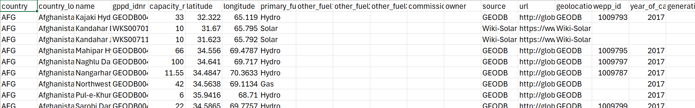
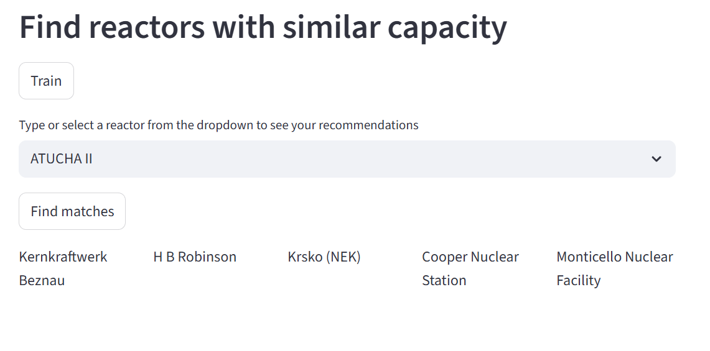

# ReactorExplorer

ReactorExplorer is a data-driven application designed to help users explore and compare nuclear power plant reactor types using a recommendation engine based on similarity metrics. The goal is to provide an interactive way to analyze reactor specifications, performance characteristics, fuel type, safety attributes, and operational data.

Features

Reactor recommendation engine — find similar plants based on technical specifications

ML-based similarity model — k-NN

Automated data preprocessing pipeline

Modular structure for scalability & improvements

---

## Table of Contents
- [Features](#features)
- [Project Structure](#project-structure)
- [Installation](#installation)
- [Usage](#usage)
- [Configuration](#configuration)
- [Contributing](#contributing)
- [License](#license)

---

## Features
- **Data Ingestion**: Download and extract raw datasets.
- **Data Validation**: Validate the dataset against predefined schemas.
- **Data Transformation**: Clean and transform data for analysis.
- **Model Training**: Train a recommendation model using `NearestNeighbors`.
- **Recommendation System**: Suggest similar power plants based on input criteria.

---

## Project Structure
```
ReactorExplorer/
│
├── src/
├── tests/
├── data/
├── research/
├── CHANGELOG.md
├── README.md
└── ...
```
---
**Changelog:** See [CHANGELOG.md](CHANGELOG.md) for version history.

---
## Installation
```
git clone https://github.com/varshagandhi-01/ReactorExplorer
cd ReactorExplorer
pip install -r requirements.txt

```
---
## Usage
Jupyter Notebook
```
jupyter notebook notebooks/reactor_exploration.ipynb
```
Streamlit Web App 
```
streamlit run app.py
```
---
## Model / Approach
Stage       	    Description
Data Collection	    Public nuclear reactor datasets
Preprocessing	    Cleaning, scaling, handling missing values
Feature Engineering	Technical attributes used as similarity vectors
Model	            k-Nearest Neighbors
Evaluation	        Qualitative similarity & clustering visualization

Example Output
Query Reactor	Recommended Similar Reactors
Armenian-2      ATUCHA I, Kernkraftwerk Maehleberg, M.A.P.P., N.A.P.S, KAKRAPARA


Dataset Info

Source: WRI

Key attributes: Capacity MW, Name

## Roadmap

Add clustering visualizations (UMAP/PCA)

Build evaluation metrics dashboard

Add model benchmarking
---

## AWS-CICD-Deployment-with-Github-Actions

### 1. Login to AWS Console

### 2. Create IAM user for deployment

### 3. Create ECR repo to store/save docker image

### 4. Create EC2 machine (Ubuntu)

### 5. Open EC2 and Install docker in EC2 Machine:
```
#optional

sudo apt-get update -y

sudo apt-get upgrade

#required

curl -fsSL https://get.docker.com -o get-docker.sh

sudo sh get-docker.sh

sudo usermod -aG docker ubuntu

newgrp docker

#confirm
docker --version
```
### 6. Configure EC2 as self-hosted runner
```
github>setting>actions>runner>new self hosted runner> choose os> then run command one by one
```
### 7. Setup github secrets
```
AWS_ACCESS_KEY_ID
AWS_SECRET_ACCESS_KEY
AWS_REGION
AWS_ECR_LOGIN_URI
ECR_REPOSITORY_NAME
```
### Input:
List of reactors (as per data file source: WRI)

Data source sample:


### Output:
